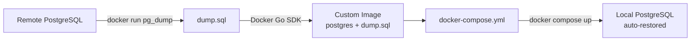

# psqldump

Dump a remote PostgreSQL database and create a self-restoring Docker Compose setup without local PostgreSQL client tools.

## How it works



1. **Dump**: runs `pg_dump` inside a version-matched `postgres:<major>-alpine` container.
2. **Build**: uses the Docker Go SDK to build a PostgreSQL image with the dump copied into `/docker-entrypoint-initdb.d/`.
3. **Compose**: generates a `docker-compose.yml` that starts the image and auto-restores the database on first startup.

## Prerequisites

- [Go](https://go.dev/dl/) 1.26+
- [Docker](https://docs.docker.com/get-docker/) with the daemon running
- Network access to the remote PostgreSQL server

## Install

```bash
go install ./cmd/psqldump
```

Or build locally:

```bash
go build -o psqldump.exe ./cmd/psqldump
```

## Usage

### Quick start

```bash
psqldump all \
  --host my-db.example.com \
  --dbname mydatabase \
  --user postgres \
  --password s3cret \
  --out ./out
```

This auto-detects the remote PostgreSQL version, dumps the database, builds a Docker image, and generates a `docker-compose.yml`.

### Step by step

```bash
# 1. Dump only
psqldump dump -H my-db.example.com -d mydatabase -U postgres -W s3cret -o ./out

# 2. Build Docker image from ./out/mydatabase.sql
psqldump build -H my-db.example.com -d mydatabase -U postgres -W s3cret -o ./out

# 3. Generate compose file
psqldump compose -d mydatabase -U postgres -W s3cret -o ./out
```

### External compose port

`-P`/`--port` is the remote PostgreSQL server port used by `pg_dump` and version detection. `-E`/`--external-port` is the host port written to the generated Compose file.

```bash
psqldump all \
  -H my-db.example.com \
  -P 6543 \
  -E 15432 \
  -d mydatabase \
  -U postgres \
  -o ./out
```

If `--external-port` is omitted, the compose file uses the value from `--port`. If both are omitted, the compose file exposes `5432:5432`.

### Start the restored database

```bash
docker compose -f ./out/docker-compose.yml up -d
```

The database will be available on the external port from the generated compose file.

## Flags

The command line uses Go's built-in `flag` package. Short flags use one dash and long flags may use either one or two dashes, so `-host` and `--host` both work.

| Flag | Short | Default | Description |
|---|---|---|---|
| `--host` | `-H` | `localhost` | Remote PostgreSQL host |
| `--port` | `-P` | `5432` | Remote PostgreSQL port |
| `--user` | `-U` | `postgres` | PostgreSQL user |
| `--password` | `-W` | `PGPASSWORD` env or empty | PostgreSQL password |
| `--dbname` | `-d` | required | Database name |
| `--out` | `-o` | `.` | Output directory for dump and compose file |
| `--external-port` | `-E` | value of `--port` | Host port in the generated compose file |
| `--pg-version` | | auto-detect | PostgreSQL major version for the dump client and Docker image |

## Commands

| Command | Description |
|---|---|
| `dump` | Dump the remote database to a `.sql` file |
| `build` | Build a Docker image with the dump baked in |
| `compose` | Generate a `docker-compose.yml` |
| `all` | Run dump, build, and compose in sequence |

## How the auto-restore works

The generated Docker image is based on the official `postgres` image. The dump file is copied to `/docker-entrypoint-initdb.d/`, which the PostgreSQL entrypoint script executes automatically on first start.

- `docker compose up` starts the database and restores the dump automatically.
- Later starts skip the restore because data persists in the named volume.

## Example: full workflow

```bash
# Dump a remote production database and create a local replica
psqldump all \
  -H prod-db.internal \
  -d app_production \
  -U readonly_user \
  -W "$PROD_PASSWORD" \
  -E 15432 \
  -o ./local-pg

# Start it
docker compose -f ./local-pg/docker-compose.yml up -d

# Connect
psql -h localhost -p 15432 -U readonly_user -d app_production
```

## License

MIT License
