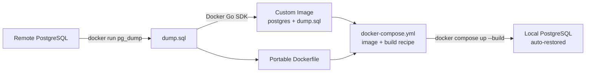

# psqldump

Dump a remote PostgreSQL database and create a self-restoring Docker Compose setup without local PostgreSQL client tools.

## How it works


```mermaid
flowchart LR
    A[Remote PostgreSQL] -->|docker run pg_dump| B[dump.sql]
    B -->|Docker Go SDK| C[Custom Image<br/>postgres + dump.sql]
    B --> F[Portable Dockerfile]
    C --> D[docker-compose.yml<br/>image + build recipe]
    F --> D
    D -->|docker compose up --build| E[Local PostgreSQL<br/>auto-restored]
```

1. **Dump**: runs `pg_dump` inside a version-matched `postgres:<major>-alpine` container.
2. **Build**: uses the Docker Go SDK to build a PostgreSQL image with the dump copied into `/docker-entrypoint-initdb.d/`. It also writes the same build recipe to `psqldump.Dockerfile` and a narrow build-context ignore file.
3. **Compose**: generates a `docker-compose.yml` that starts the image and auto-restores the database on first startup. The relative build recipe lets Compose recreate the image on another computer.

## Prerequisites

- [Docker](https://docs.docker.com/get-docker/) with the daemon running
- Network access to the remote PostgreSQL server

## Install

Download the latest release for your platform from the [Releases](https://github.com/ralscha/psqldump/releases) page. 

## Usage

### Quick start

```bash
export PGPASSWORD='source-database-password'
export PSQLDUMP_TARGET_PASSWORD='choose-a-local-password'

psqldump all \
  --host my-db.example.com \
  --dbname mydatabase \
  --user postgres \
  --out ./out
```

`PGPASSWORD` authenticates to the source server. `PSQLDUMP_TARGET_PASSWORD` sets a separate password for the restored database. Keeping them separate prevents the source credential from being written into the portable Compose bundle. The equivalent `--password` and `--target-password` flags are supported, but environment variables avoid saving passwords in shell history.

This auto-detects the remote PostgreSQL version, dumps the database, builds a Docker image, and generates a `docker-compose.yml`.

### Step by step

```bash
# 1. Dump only (with PGPASSWORD set in the environment)
psqldump dump -H my-db.example.com -d mydatabase -U postgres -o ./out

# 2. Build the image and write ./out/psqldump.Dockerfile
psqldump build -H my-db.example.com -d mydatabase -U postgres -o ./out

# 3. Generate compose file (with PSQLDUMP_TARGET_PASSWORD set)
psqldump compose -d mydatabase -U postgres -o ./out
```

`compose` and `all` require a target password. `dump` and `build` do not. The generated service includes a PostgreSQL readiness healthcheck.

### Start the restored database

```bash
docker compose -f ./out/docker-compose.yml up -d --build
```

The database will be available on the external port from the generated compose file.

### Move the result to another computer

Copy the complete output directory, including the SQL dump, `psqldump.Dockerfile`, `psqldump.Dockerfile.dockerignore`, and `docker-compose.yml`. On the destination computer, run:

```bash
cd out
docker compose up -d --build
```

Compose rebuilds the custom image from the files in that directory, so it does not depend on the source computer's local Docker image. The destination needs network access to pull the versioned official `postgres` base image if it is not already cached.

## Flags

The command line uses Go's built-in `flag` package. Short flags use one dash and long flags may use either one or two dashes, so `-host` and `--host` both work.

| Flag | Short | Default | Description |
|---|---|---|---|
| `--host` | `-H` | `localhost` | Remote PostgreSQL host |
| `--port` | `-P` | `5432` | Remote PostgreSQL port |
| `--user` | `-U` | `postgres` | PostgreSQL user |
| `--password` | `-W` | `PGPASSWORD` env or empty | Source PostgreSQL password |
| `--target-password` | | `PSQLDUMP_TARGET_PASSWORD` env or empty | Password for the restored database; required by `compose` and `all` |
| `--dbname` | `-d` | required | Database name |
| `--out` | `-o` | `.` | Output directory for dump and compose file |
| `--external-port` | `-E` | value of `--port` | Host port in the generated compose file |
| `--pg-version` | | auto-detect | PostgreSQL major version for the dump client and Docker image |

If `--external-port` is omitted, the compose file uses the value from `--port`. If both are omitted, the compose file exposes `5432:5432`.

## Commands

| Command | Description |
|---|---|
| `dump` | Dump the remote database to a `.sql` file |
| `build` | Build a Docker image and write its portable Dockerfile |
| `compose` | Generate a portable `docker-compose.yml` |
| `all` | Run dump, build, and compose in sequence |
| `version` | Print the installed psqldump version |

Database names that cannot be used directly as portable artifacts or Docker image names (for example, names containing spaces, Unicode, or path separators) are converted to deterministic, collision-resistant artifact names. The original database name is still used when connecting and restoring.


## License

MIT License
